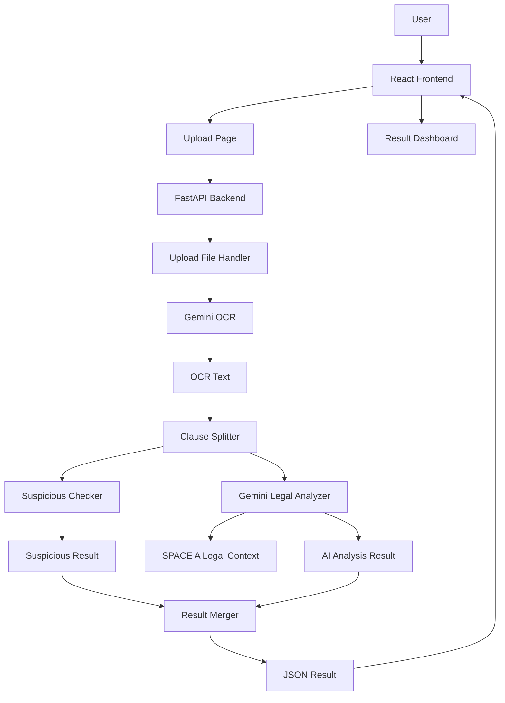

# RentalGuard AI — 租賃契約智慧分析系統

> AI-powered Lease Risk Analyzer for Taiwanese rental contracts.

RentalGuard AI 是一套租賃契約智慧分析系統，目標是協助學生、租屋族、外籍生與一般承租人快速理解租屋契約中的法律風險。

使用者只需要上傳租賃契約圖片或 PDF，系統會透過 Gemini API 進行 OCR 文字辨識，接著根據 SPACE A 法規資料庫分析契約條款，找出可能違法、不合理、疑似惡意竄改或需要注意的內容。

---

## 目錄

- [專案簡介](#專案簡介)
- [核心功能](#核心功能)
- [目前完成進度](#目前完成進度)
- [Update Log](#update-log)
- [系統架構](#系統架構)
- [技術棧說明](#技術棧說明)
- [專案資料夾結構](#專案資料夾結構)
- [前端說明](#前端說明)
- [後端說明](#後端說明)
- [API 設計](#api-設計)
- [如何啟動專案](#如何啟動專案)
- [環境變數設定](#環境變數設定)
- [GitHub 協作規範](#github-協作規範)
- [目前限制](#目前限制)
- [下一階段 Roadmap](#下一階段-roadmap)
- [組員快速上手指南](#組員快速上手指南)

---

## 專案簡介

在台灣租屋市場中，承租人常常會遇到以下問題：

```text
看不懂法律條文
不知道哪些條款違法
不知道押金、違約金、修繕、戶籍相關規定
外籍生或新住民可能看不懂中文契約
房東可能偷偷修改契約文字
````

RentalGuard AI 的目標是讓使用者能夠：

```text
上傳租約
→ 自動 OCR 辨識契約文字
→ 根據 SPACE A 法規資料分析
→ 找出風險條款
→ 提供白話說明、法規依據與修改建議
```

---

## 核心功能

### 1. 契約上傳分析

使用者可以上傳：

```text
圖片
PDF
租賃契約掃描檔
```

目前已完成前端上傳介面與後端接收流程。

---

### 2. Gemini OCR

系統會將使用者上傳的契約檔案送到 Gemini API，要求模型只進行 OCR 文字辨識。

OCR 輸出後，系統會得到完整契約文字。

---

### 3. 條款切段

後端會將 OCR 文字切成一條一條契約條款。

目前已從初版「句子切段」升級成較適合租賃契約的「條文切段」。

例如：

```text
第十七條
第十八條
第十九條
第二十條
第二十一條
```

---

### 4. SPACE A 法規分析

系統會讀取 SPACE A 法規資料庫，將其作為 AI 分析契約的依據。

目前已完成：

```text
space_a_FINAL.xlsx
→ space_a_context.txt
→ 後端讀取
→ Gemini 分析使用
```

---

### 5. 疑似竄改偵測

這是目前系統的亮點功能之一。

一般 LLM 可能只判斷條款是否合法，但不一定能抓出小字異常或惡意替換。

因此我們新增了 `suspicious_checker_service.py`，用規則先檢查可疑字詞。

目前可偵測：

```text
地址 → 現場
押金全額沒收
不得遷入戶籍
押金為三個月
不得申報租賃所得
```

範例：

```text
原本應為：
應以本契約所記載之地址為準

遭修改為：
應以本契約所記載之現場為準
```

系統會標記為：

```text
疑似竄改
通知送達條款異常
建議確認是否應為「地址」
```

---

### 6. Result Merger 結果整合

原本可能出現同一條款被顯示兩次：

```text
第十九條：疑似竄改
第十九條：合法
```

現在已新增 `result_merger_service.py`，將可疑檢查結果與 AI 法規分析結果整合成同一筆。

目前流程為：

```text
Suspicious Checker 結果
+ Gemini AI 分析結果
→ Result Merger
→ 前端顯示單一整合結果
```

---

### 7. 前端 v2 UI

目前已完成 React + Tailwind CSS 前端重構。

包含：

```text
SaaS 風格首頁
Hero 區
功能介紹卡片
高級上傳區塊
分析中 loading 狀態
結果統計卡
OCR 文字區
風險分析卡片
Icon 視覺化
```

---

## 目前完成進度

### 已完成

| 項目                 | 狀態     | 說明                    |
| ------------------ | ------ | --------------------- |
| React 前端           | 完成     | 已可上傳檔案、選擇語言、顯示分析結果    |
| Tailwind UI v2     | 完成     | 已升級成 SaaS 產品風格        |
| FastAPI 後端         | 完成     | 已建立 `/api/analyze`    |
| 前後端串接              | 完成     | React 可成功呼叫 FastAPI   |
| Gemini OCR         | 完成     | 可辨識圖片 / PDF 文字        |
| Gemini 法律分析        | 完成     | 可根據 SPACE A 分析條款      |
| SPACE A 導入         | 完成     | 已將正式 Excel 轉為 context |
| 條款切段               | 完成初版升級 | 已可依第幾條切段              |
| suspicious checker | 完成初版   | 可抓出常見疑似竄改字詞           |
| result merger      | 完成初版   | 可合併 checker 與 AI 結果   |
| GitHub 版控          | 完成     | 已建立 git 協作流程          |
| README 文件          | 更新中    | 本文件為 Pro 版 README     |

---

### 尚未完成

| 項目                   | 優先級 | 說明                               |
| -------------------- | --- | -------------------------------- |
| OCR 清理               | 高   | 修正 OCR 錯字、漏字、斷句問題                |
| Gemini Context Cache | 高   | 降低 SPACE A 重複送 prompt 的 token 成本 |
| 多頁 PDF 優化            | 高   | 支援整份契約多頁穩定分析                     |
| 法規引用格式優化             | 中   | 將 LEASE-ACT-006 轉為白話法規名稱         |
| 歷史紀錄                 | 中   | 儲存過去分析紀錄                         |
| PDF 報告               | 中   | 匯出分析結果報告                         |
| 登入系統                 | 低   | 之後可用 Supabase Auth               |
| 後台管理                 | 低   | 管理 SPACE A / 可疑詞規則               |

---

## Update Log

### 2026-04-29 — MVP v0.3：分析準確度與 UI 升級

#### 新增

```text
新增 suspicious_checker_service.py
新增 result_merger_service.py
新增前端 v2 SaaS UI
新增結果統計卡片
新增 lucide-react icon
新增疑似竄改偵測流程
```

#### 優化

```text
條款切段從句子切段升級為條文切段
分析結果不再重複顯示同一條款
前端畫面從 MVP 樣式升級為產品展示樣式
ResultCard 改成風險分級卡片
UploadPage 改成完整 Landing Page + 分析區
```

#### 測試結果

成功偵測：

```text
第十九條「地址」遭修改成「現場」
```

系統輸出：

```text
疑似竄改
通知送達條款通常應以契約所記載之地址為準
建議確認此處是否應為「地址」
```

#### 已知問題

```text
Gemini OCR 偶爾會漏字或斷句
OCR 錯誤會影響後續條款切段與分析
尚未導入 OCR cleaner
```

---

### 2026-04-28 — MVP v0.2：SPACE A 正式導入

#### 新增

```text
導入 space_a_FINAL.xlsx
建立 build_space_a_context.py
產生 space_a_context.txt
後端可讀取正式 SPACE A 法規資料
```

#### 完成

```text
Gemini 法律分析開始引用 SPACE A
不再只依賴測試版假資料
```

---

### 2026-04-27 — MVP v0.1：前後端打通

#### 新增

```text
建立 React 前端
建立 FastAPI 後端
完成 /api/analyze
完成 Gemini OCR
完成 Gemini 分析
完成前後端串接
```

#### 成果

```text
使用者可從前端上傳契約
後端可回傳 OCR 文字與分析結果
React 可顯示完整分析內容
```

---

## 系統架構



---

## 技術棧說明

### Frontend

| 技術           | 用途           |
| ------------ | ------------ |
| React        | 建立前端畫面與元件    |
| Vite         | 前端開發伺服器與打包工具 |
| Tailwind CSS | 快速建立現代化 UI   |
| lucide-react | Icon 圖示庫     |
| JavaScript   | 前端主要語言       |

---

### Backend

| 技術               | 用途                   |
| ---------------- | -------------------- |
| Python 3.11      | 後端主要語言               |
| FastAPI          | 建立 API 服務            |
| Uvicorn          | 啟動 FastAPI 伺服器       |
| python-multipart | 接收上傳檔案               |
| python-dotenv    | 讀取 `.env` 環境變數       |
| google-genai     | 呼叫 Gemini API        |
| pandas           | 讀取與轉換 Excel          |
| openpyxl         | 支援 pandas 讀取 `.xlsx` |

---

### AI / Data

| 項目                    | 用途              |
| --------------------- | --------------- |
| Gemini OCR            | 擷取契約圖片 / PDF 文字 |
| Gemini Legal Analysis | 分析條款風險          |
| SPACE A               | 法規資料庫           |
| suspicious rules      | 可疑竄改字詞規則        |
| result merger         | 整合規則檢查與 AI 結果   |

---

## 專案資料夾結構

```text
rentalguard-ai/
│
├── frontend/
│   ├── src/
│   │   ├── api/
│   │   │   └── analyzeApi.js
│   │   │
│   │   ├── components/
│   │   │   └── ResultCard.jsx
│   │   │
│   │   ├── pages/
│   │   │   └── UploadPage.jsx
│   │   │
│   │   ├── App.jsx
│   │   ├── main.jsx
│   │   └── index.css
│   │
│   ├── package.json
│   ├── package-lock.json
│   └── vite.config.js
│
├── backend/
│   ├── app/
│   │   ├── main.py
│   │   ├── config.py
│   │   │
│   │   ├── routers/
│   │   │   └── analyze_router.py
│   │   │
│   │   ├── services/
│   │   │   ├── gemini_ocr_service.py
│   │   │   ├── gemini_analysis_service.py
│   │   │   ├── clause_service.py
│   │   │   ├── law_cache_service.py
│   │   │   ├── build_space_a_context.py
│   │   │   ├── suspicious_checker_service.py
│   │   │   ├── result_merger_service.py
│   │   │   └── llm_client.py
│   │   │
│   │   └── data/
│   │       ├── space_a_FINAL.xlsx
│   │       └── space_a_context.txt
│   │
│   ├── requirements.txt
│   ├── .env.example
│   └── .env
│
├── .gitignore
└── README.md
```

---

## 前端說明

前端使用 React + Vite + Tailwind CSS。

### React 是什麼？

React 是一個用來建立互動式網頁的 JavaScript 函式庫。

在本專案中，React 負責：

```text
顯示首頁
處理檔案上傳
選擇分析語言
呼叫後端 API
顯示 OCR 文字
顯示分析結果卡片
```

---

### Vite 是什麼？

Vite 是前端開發工具。

它負責：

```text
啟動前端開發伺服器
讓 React 即時更新畫面
打包前端專案
```

啟動方式：

```bash
cd frontend
npm run dev
```

預設網址：

```text
http://localhost:5173
```

---

### Tailwind CSS 是什麼？

Tailwind CSS 是一套 utility-first CSS 工具。

以前寫 CSS 可能是：

```css
.card {
  background-color: white;
  padding: 24px;
  border-radius: 16px;
}
```

使用 Tailwind 後可以直接寫：

```jsx
<div className="bg-white p-6 rounded-2xl">
```

本專案用 Tailwind 處理：

```text
版面排版
按鈕
卡片
陰影
圓角
漸層
響應式設計
```

---

### lucide-react 是什麼？

`lucide-react` 是 icon 圖示套件。

目前用在：

```text
ShieldCheck
UploadCloud
FileText
AlertTriangle
CheckCircle
Scale
Languages
Loader2
```

讓畫面更像正式產品，而不是單純文字頁面。

---

## 前端主要檔案

### `src/pages/UploadPage.jsx`

目前前端最核心的頁面。

功能：

```text
顯示 SaaS 首頁
顯示功能介紹
提供上傳區
呼叫 analyze API
顯示 loading 狀態
顯示 OCR 文字
顯示結果統計
顯示 ResultCard
```

---

### `src/components/ResultCard.jsx`

分析結果卡片。

會根據風險等級顯示不同樣式：

```text
high → 高風險 / 紅色
medium → 需注意 / 黃色
low → 低風險 / 綠色
```

顯示欄位：

```text
條款
原因
法規依據
建議
法規連結
```

---

### `src/api/analyzeApi.js`

負責呼叫後端 API。

目前呼叫：

```text
POST http://localhost:8000/api/analyze
```

送出資料：

```text
file
language
```

---

## 後端說明

後端使用 FastAPI + Python + Gemini API。

---

### FastAPI 是什麼？

FastAPI 是 Python 的後端框架，用來建立 API。

本專案目前主要 API：

```text
POST /api/analyze
```

前端將契約檔案送給此 API，後端回傳分析結果。

---

### Uvicorn 是什麼？

Uvicorn 是 FastAPI 的執行伺服器。

啟動方式：

```bash
uvicorn app.main:app --reload
```

---

### google-genai 是什麼？

`google-genai` 是 Google Gemini API 的 Python SDK。

本專案用它做兩件事：

```text
Gemini OCR
Gemini 法律分析
```

---

### pandas / openpyxl 是什麼？

這兩個套件用來讀取 Excel。

本專案使用它們將：

```text
space_a_FINAL.xlsx
```

轉換成：

```text
space_a_context.txt
```

讓 Gemini 更容易讀取法規資料。

---

## 後端主要檔案

### `app/main.py`

FastAPI 主程式。

負責：

```text
建立 FastAPI app
設定 CORS
掛載 analyze_router
提供 health check
```

---

### `app/config.py`

讀取環境變數。

例如：

```text
GEMINI_API_KEY
GEMINI_MODEL
```

---

### `app/routers/analyze_router.py`

主要 API 路由。

流程：

```text
接收檔案
→ Gemini OCR
→ 條款切段
→ 可疑詞檢查
→ Gemini 法律分析
→ 結果合併
→ 回傳 JSON
```

---

### `app/services/gemini_ocr_service.py`

負責 OCR。

輸入：

```text
圖片 / PDF bytes
```

輸出：

```text
OCR 文字
```

---

### `app/services/clause_service.py`

負責條款切段。

目前已支援依「第幾條」切段。

---

### `app/services/law_cache_service.py`

負責讀取 SPACE A context。

目前是本地讀取：

```text
space_a_context.txt
```

未來會升級為 Gemini Context Cache。

---

### `app/services/gemini_analysis_service.py`

負責 Gemini 法律分析。

輸入：

```text
契約條款
SPACE A 法規資料
語言
```

輸出：

```text
JSON 分析結果
```

---

### `app/services/suspicious_checker_service.py`

負責規則式可疑詞檢查。

目前可抓：

```text
現場
押金全額沒收
不得遷入戶籍
押金為三個月
不得申報租賃所得
```

---

### `app/services/result_merger_service.py`

負責合併結果。

目的：

```text
避免同一條款同時出現 checker 結果與 AI 結果兩張卡
```

---

### `app/services/llm_client.py`

負責 LLM 呼叫防禦機制。

設計方向：

```text
Retry
Exponential Backoff
Circuit Breaker
Model Fallback
```

目的：

```text
降低 503 / 429 對系統穩定性的影響
```

---

## API 設計

### POST `/api/analyze`

功能：

```text
上傳租賃契約並回傳分析結果
```

Request：

```text
form-data:
file: image / pdf
language: zh-TW / en / ja / vi
```

Response：

```json
{
  "ocr_text": "契約 OCR 文字",
  "clauses": [
    "第十九條 履行本契約之通知..."
  ],
  "results": [
    {
      "clause": "第十九條 履行本契約之通知...",
      "risk_level": "high",
      "status": "疑似竄改",
      "reason": "通知送達條款通常應以地址為準...",
      "law_reference": "可疑用語檢查：通知送達",
      "law_url": "",
      "suggestion": "建議確認此處是否應為「地址」..."
    }
  ]
}
```

---

## 如何啟動專案

### 1. 後端啟動

進入後端資料夾：

```bash
cd backend
```

啟動虛擬環境：

```bash
rentalguard\Scripts\activate
```

安裝套件：

```bash
pip install -r requirements.txt
```

啟動 FastAPI：

```bash
uvicorn app.main:app --reload
```

後端網址：

```text
http://127.0.0.1:8000
```

API 文件：

```text
http://127.0.0.1:8000/docs
```

---

### 2. 前端啟動

開另一個 terminal：

```bash
cd frontend
```

安裝套件：

```bash
npm install
```

啟動 React：

```bash
npm run dev
```

前端網址：

```text
http://localhost:5173
```

---

## 環境變數設定

請在後端建立：

```text
backend/.env
```

內容：

```env
GEMINI_API_KEY=your_gemini_api_key_here
GEMINI_MODEL=gemini-2.5-flash
```

`.env` 不可以上傳 GitHub。

請提供 `.env.example` 給組員參考：

```env
GEMINI_API_KEY=your_gemini_api_key_here
GEMINI_MODEL=gemini-2.5-flash
```

---

## GitHub 協作規範

### `.gitignore` 必須忽略

```text
.env
node_modules
dist
venv
rentalguard
__pycache__
*.log
```

原因：

| 檔案                   | 不上傳原因                |
| -------------------- | -------------------- |
| `.env`               | 包含 API Key           |
| `node_modules`       | 太大，可用 npm install 重建 |
| `rentalguard / venv` | Python 虛擬環境，不需上傳     |
| `__pycache__`        | Python 自動產生          |
| `dist`               | 前端打包產物               |

---

### 建議 commit 規範

```bash
feat: 新增功能
fix: 修正錯誤
style: UI 樣式調整
refactor: 程式重構
docs: 文件更新
chore: 雜項設定
```

範例：

```bash
git commit -m "feat: add suspicious checker service"
git commit -m "feat: add result merger service"
git commit -m "style: upgrade frontend SaaS UI"
git commit -m "docs: update README with progress log"
```

---

### 每次開發流程

```bash
git pull
git status
git add .
git commit -m "描述這次修改"
git push origin main
```

---

## 目前限制

### 1. OCR 品質仍不穩

Gemini OCR 偶爾會出現：

```text
漏字
錯字
斷句錯誤
勾選框辨識錯誤
PDF 直式排版辨識不完整
```

目前暫時接受，之後會加入：

```text
ocr_cleaner_service.py
OCR 品質檢查
OCR 修正提示
```

---

### 2. SPACE A 尚未使用 Context Cache

目前是每次分析都把 `space_a_context.txt` 放進 prompt。

缺點：

```text
token 消耗較大
容易遇到 429
長 prompt 可能增加 503 機率
```

下一步會導入：

```text
Gemini Context Cache
```

---

### 3. 法規引用格式還可以更友善

目前可能顯示：

```text
LEASE-ACT-006
LEASE-STD-007
```

未來希望顯示：

```text
住宅租賃專法 第11條
住宅租賃定型化契約應記載事項 第7點
```

---

### 4. 目前沒有登入與歷史紀錄

系統目前是單次分析流程，尚未建立：

```text
使用者帳號
分析歷史
每日分析次數限制
PDF 報告儲存
```

---

## 下一階段 Roadmap

### Phase 1.1 — 分析準確度強化

```text
導入 OCR cleaner
擴充 suspicious rules
優化條款切段
優化法規引用格式
減少 LLM 幻覺
```

---

### Phase 1.2 — 成本與穩定性優化

```text
導入 Gemini Context Cache
完成 llm_client.py 整合
處理 429 / 503
加入 retry / fallback
降低 token 使用量
```

---

### Phase 1.3 — 前端產品化

```text
增加分析進度條
增加風險總分
增加條款篩選
增加展開 / 收合
增加錯誤提示
增加使用者操作引導
```

---

### Phase 1.4 — 使用者系統

```text
登入 / 註冊
歷史紀錄
分析次數限制
PDF 報告
重要期限提醒
```

---

## 組員快速上手指南

如果你第一次接觸這個專案，先不用全部看懂。

請先理解主流程：

```text
使用者上傳租約
→ React 前端送檔案到 FastAPI
→ FastAPI 呼叫 Gemini OCR
→ Gemini 回傳契約文字
→ 後端切條款
→ suspicious checker 先抓可疑字
→ Gemini 根據 SPACE A 做法律分析
→ result merger 合併結果
→ React 顯示分析報告
```

最重要的三個檔案：

```text
frontend/src/pages/UploadPage.jsx
backend/app/routers/analyze_router.py
backend/app/services/gemini_analysis_service.py
```

如果要看 UI：

```text
frontend/src/pages/UploadPage.jsx
frontend/src/components/ResultCard.jsx
```

如果要看後端流程：

```text
backend/app/routers/analyze_router.py
```

如果要看 AI 分析：

```text
backend/app/services/gemini_analysis_service.py
```

如果要看疑似竄改偵測：

```text
backend/app/services/suspicious_checker_service.py
```

如果要看結果合併：

```text
backend/app/services/result_merger_service.py
```

---

## 專案一句話總結

RentalGuard AI 是一套以 React + FastAPI + Gemini API 建構的租賃契約智慧分析系統，能夠自動 OCR 讀取契約、根據 SPACE A 法規資料分析條款風險，並偵測疑似惡意竄改內容，協助承租人在簽約前快速理解租約風險。

````

推上 GitHub：

```bash
git add README.md
git commit -m "docs: update professional README with update log"
git push origin main
````
