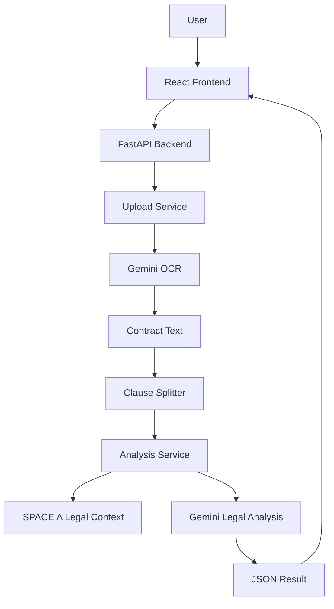

# RentalGuard AI — 租賃契約智慧分析系統

## 一、專案簡介

RentalGuard AI 是一個租賃契約智慧分析系統。

使用者可以上傳租屋契約圖片或 PDF，系統會透過 Gemini API 進行 OCR 文字辨識，再根據我們整理好的 SPACE A 法規資料庫，分析契約中是否存在違法、不合理或疑似被竄改的條款。

目前系統已完成初版 MVP：

```text
React 前端
→ FastAPI 後端
→ Gemini OCR
→ 條款切段
→ SPACE A 法規分析
→ Gemini 回傳分析結果
→ React 顯示分析報告
````

---

## 二、目前完成進度

### 已完成

| 項目          | 狀態  | 說明                    |
| ----------- | --- | --------------------- |
| React 前端    | 已完成 | 可上傳檔案、選擇語言、顯示分析結果     |
| FastAPI 後端  | 已完成 | 已建立 API，前端可成功呼叫       |
| Gemini OCR  | 已完成 | 可辨識租賃契約圖片 / PDF 文字    |
| Gemini 法律分析 | 已完成 | 可根據 SPACE A 分析條款      |
| 前後端串接       | 已完成 | React 可成功送檔案到 FastAPI |
| SPACE A 導入  | 已完成 | 已將正式資料轉成 context 文字檔  |
| GitHub 版控   | 已完成 | 專案已加入 git 管理          |
| 可疑竄改字想法     | 已規劃 | 例如「地址」被改成「現場」這類細節     |

### 尚未完成

| 項目                   | 優先級 | 說明                       |
| -------------------- | --- | ------------------------ |
| suspicious checker   | 高   | 用規則抓疑似惡意修改字詞             |
| Gemini Context Cache | 高   | 將 SPACE A 快取，降低 token 成本 |
| 多頁上傳                 | 高   | 支援整份契約多頁分析               |
| 前端 UI 優化             | 中   | 讓分析結果更像正式產品              |
| 歷史紀錄                 | 中   | 儲存使用者過去分析結果              |
| PDF 報告               | 低   | 匯出分析結果                   |
| 登入系統                 | 低   | 之後可用 Supabase Auth       |

---

## 三、系統架構



---

## 四、專案資料夾結構

```text
rentalguard-ai/
│
├── frontend/
│   ├── src/
│   │   ├── api/
│   │   │   └── analyzeApi.js
│   │   │
│   │   ├── components/
│   │   │   ├── ResultCard.jsx
│   │   │   ├── FileUploader.jsx
│   │   │   └── LoadingBox.jsx
│   │   │
│   │   ├── pages/
│   │   │   └── UploadPage.jsx
│   │   │
│   │   ├── App.jsx
│   │   ├── main.jsx
│   │   └── index.css
│   │
│   ├── package.json
│   └── vite.config.js
│
├── backend/
│   ├── app/
│   │   ├── main.py
│   │   ├── config.py
│   │   │
│   │   ├── routers/
│   │   │   └── analyze_router.py
│   │   │
│   │   ├── services/
│   │   │   ├── gemini_ocr_service.py
│   │   │   ├── gemini_analysis_service.py
│   │   │   ├── clause_service.py
│   │   │   ├── law_cache_service.py
│   │   │   └── build_space_a_context.py
│   │   │
│   │   └── data/
│   │       ├── space_a_FINAL.xlsx
│   │       └── space_a_context.txt
│   │
│   ├── requirements.txt
│   ├── .env.example
│   └── .env
│
├── .gitignore
└── README.md
```

---

## 五、前端技術說明

前端使用 React + Vite + Tailwind CSS。

### 1. React 是什麼？

React 是一個前端 JavaScript 函式庫，用來建立網頁畫面。

我們用 React 來做：

```text
上傳契約畫面
語言選擇
分析按鈕
分析結果卡片
OCR 文字顯示區
```

React 的核心概念是「元件」。

例如：

```text
UploadPage.jsx      整個上傳分析頁面
ResultCard.jsx      單一分析結果卡片
FileUploader.jsx    上傳檔案元件
LoadingBox.jsx      分析中的提示畫面
```

---

### 2. Vite 是什麼？

Vite 是 React 專案的開發工具。

它負責：

```text
啟動前端開發伺服器
即時更新畫面
打包前端程式
讓 React 專案跑起來
```

啟動前端使用：

```bash
cd frontend
npm run dev
```

預設網址：

```text
http://localhost:5173
```

---

### 3. Tailwind CSS 是什麼？

Tailwind CSS 是一個 CSS 工具。

傳統 CSS 寫法：

```css
.card {
  background-color: white;
  padding: 24px;
  border-radius: 16px;
}
```

Tailwind 寫法：

```jsx
<div className="bg-white p-6 rounded-2xl">
```

我們目前用 Tailwind 來快速美化前端畫面，例如：

```text
按鈕
卡片
上傳區塊
背景顏色
排版
間距
陰影
```

---

### 4. 前端主要檔案說明

#### `src/main.jsx`

React 入口檔案。

負責把 React App 掛載到 HTML 頁面上。

```text
main.jsx
→ 載入 App.jsx
→ 顯示整個網站
```

---

#### `src/App.jsx`

目前只負責載入主要頁面：

```text
App.jsx
→ UploadPage.jsx
```

---

#### `src/pages/UploadPage.jsx`

這是目前前端最重要的頁面。

負責：

```text
顯示首頁
上傳檔案
選擇語言
呼叫後端 API
接收分析結果
顯示 OCR 文字
顯示分析結果
```

---

#### `src/api/analyzeApi.js`

這是前端呼叫後端的地方。

目前會呼叫：

```text
POST http://localhost:8000/api/analyze
```

送出的資料包含：

```text
file      使用者上傳的契約檔案
language  使用者選擇的輸出語言
```

---

#### `src/components/ResultCard.jsx`

這是分析結果卡片。

每一條契約分析結果會變成一張卡片。

會顯示：

```text
風險等級
狀態
條款原文
原因
法規依據
建議修改方式
法律連結
```

---

## 六、後端技術說明

後端使用 FastAPI + Python + Gemini API。

### 1. FastAPI 是什麼？

FastAPI 是 Python 的後端框架。

它可以建立 API，讓前端可以傳資料給後端。

目前我們的主要 API 是：

```text
POST /api/analyze
```

前端會把使用者上傳的檔案送到這個 API，後端會回傳分析結果。

---

### 2. Uvicorn 是什麼？

Uvicorn 是 FastAPI 的伺服器。

FastAPI 本身只是應用程式，需要 Uvicorn 幫它跑起來。

啟動後端使用：

```bash
cd backend
rentalguard\Scripts\activate
uvicorn app.main:app --reload
```

後端網址：

```text
http://127.0.0.1:8000
```

API 文件網址：

```text
http://127.0.0.1:8000/docs
```

---

### 3. python-multipart 是什麼？

因為我們要讓使用者上傳檔案。

FastAPI 接收檔案時，需要 `python-multipart` 這個套件。

沒有它，`UploadFile` 會不能正常運作。

---

### 4. python-dotenv 是什麼？

`python-dotenv` 用來讀取 `.env` 檔案。

我們不會把 Gemini API Key 寫死在程式碼中，而是放在：

```text
backend/.env
```

例如：

```env
GEMINI_API_KEY=your_api_key_here
GEMINI_MODEL=gemini-2.5-flash
```

程式會從 `.env` 讀取 API Key。

---

### 5. google-genai 是什麼？

`google-genai` 是 Google Gemini API 的 Python SDK。

我們用它做兩件事：

```text
1. Gemini OCR
2. Gemini 法律分析
```

也就是：

```text
契約圖片 / PDF → Gemini OCR → 契約文字
契約文字 + SPACE A → Gemini 分析 → JSON 結果
```

---

### 6. pandas 是什麼？

pandas 是 Python 資料處理工具。

我們用 pandas 讀取：

```text
space_a_FINAL.xlsx
```

並把 Excel 轉成 Gemini 比較容易理解的文字資料：

```text
space_a_context.txt
```

---

### 7. openpyxl 是什麼？

openpyxl 是 Python 讀取 Excel `.xlsx` 的套件。

pandas 要讀取 Excel 時需要 openpyxl。

---

## 七、後端主要檔案說明

### `app/main.py`

FastAPI 主程式。

負責：

```text
建立 FastAPI App
設定 CORS
掛載 API Router
提供健康檢查路由
```

CORS 的作用是讓 React 前端可以呼叫 FastAPI 後端。

目前前端網址是：

```text
http://localhost:5173
```

後端網址是：

```text
http://localhost:8000
```

因為不同 port，所以需要設定 CORS。

---

### `app/config.py`

設定檔。

負責讀取：

```text
GEMINI_API_KEY
GEMINI_MODEL
```

這些資料來自 `.env`。

---

### `app/routers/analyze_router.py`

分析 API 路由。

目前主要處理：

```text
POST /api/analyze
```

流程：

```text
接收檔案
→ 呼叫 Gemini OCR
→ 條款切段
→ 呼叫 Gemini 法律分析
→ 回傳 JSON 結果
```

---

### `app/services/gemini_ocr_service.py`

Gemini OCR 模組。

功能：

```text
接收圖片或 PDF
上傳到 Gemini
要求 Gemini 只做 OCR
回傳契約文字
```

注意：

這裡不做法律分析，只負責文字辨識。

---

### `app/services/clause_service.py`

條款切段模組。

功能：

```text
把 OCR 辨識出的長文字
切成一條一條契約條款
```

目前是初版切法，主要用：

```text
句號
分號
換行
```

之後可以再優化，讓第十七條、第十八條這種完整條文不要被切太碎。

---

### `app/services/law_cache_service.py`

SPACE A 載入模組。

功能：

```text
讀取 space_a_context.txt
回傳給 Gemini 分析模組使用
```

目前還不是真正 Gemini Context Cache。

現在是「本地讀取 SPACE A 文字」。

之後會升級成：

```text
Gemini Context Cache
```

降低 token 成本。

---

### `app/services/build_space_a_context.py`

SPACE A 轉換工具。

功能：

```text
讀取 space_a_FINAL.xlsx
轉換成 space_a_context.txt
```

使用時執行：

```bash
python -m app.services.build_space_a_context
```

這個檔案不是每次啟動都要跑。

只有當 SPACE A Excel 更新時才需要重新執行。

---

### `app/services/gemini_analysis_service.py`

Gemini 法律分析模組。

功能：

```text
接收契約條款
讀取 SPACE A
組合 Prompt
呼叫 Gemini
要求 Gemini 回傳 JSON
解析 JSON
回傳給前端
```

這是目前後端最核心的檔案。

---

## 八、目前 API 設計

### POST `/api/analyze`

功能：

```text
上傳契約檔案並進行分析
```

Request：

```text
form-data
file: 圖片或 PDF
language: zh-TW / en / ja / vi
```

Response 範例：

```json
{
  "ocr_text": "契約 OCR 文字",
  "clauses": [
    "押金為三個月",
    "提前解約押金全額沒收"
  ],
  "results": [
    {
      "clause": "押金為三個月",
      "risk_level": "high",
      "status": "疑似違法",
      "reason": "押金超過二個月租金，可能違反租賃相關規範。",
      "law_reference": "SPACE A 法規依據",
      "law_url": "https://law.moj.gov.tw/",
      "suggestion": "建議修改為押金不得超過二個月租金。"
    }
  ]
}
```

---

## 九、如何啟動專案

### 1. 啟動後端

進入後端：

```bash
cd backend
```

啟動虛擬環境：

```bash
rentalguard\Scripts\activate
```

安裝套件：

```bash
pip install -r requirements.txt
```

啟動 FastAPI：

```bash
uvicorn app.main:app --reload
```

後端成功啟動後可以打開：

```text
http://127.0.0.1:8000
```

API 文件：

```text
http://127.0.0.1:8000/docs
```

---

### 2. 啟動前端

開另一個 terminal。

進入前端：

```bash
cd frontend
```

安裝套件：

```bash
npm install
```

啟動 React：

```bash
npm run dev
```

前端網址：

```text
http://localhost:5173
```

---

## 十、環境變數設定

請在後端建立：

```text
backend/.env
```

內容：

```env
GEMINI_API_KEY=你的 Gemini API Key
GEMINI_MODEL=gemini-2.5-flash
```

注意：

`.env` 不可以上傳 GitHub。

請使用：

```text
backend/.env.example
```

作為範例。

---

## 十一、GitHub 注意事項

`.gitignore` 已設定忽略以下內容：

```text
.env
node_modules
venv
rentalguard
__pycache__
dist
```

原因：

| 檔案                   | 為什麼不能上傳               |
| -------------------- | --------------------- |
| `.env`               | 裡面有 API Key           |
| `node_modules`       | 太大，而且可以重新 npm install |
| `venv / rentalguard` | Python 虛擬環境，不需要上傳     |
| `__pycache__`        | Python 自動產生           |
| `dist`               | 前端打包產物                |

---

## 十二、開發流程建議

每次開發前：

```bash
git pull
```

開發完成後：

```bash
git status
git add .
git commit -m "描述這次修改"
git push
```

Commit message 範例：

```bash
git commit -m "add gemini ocr service"
git commit -m "update frontend result card ui"
git commit -m "import space a legal context"
git commit -m "fix cors setting"
```

---

## 十三、目前系統限制

### 1. SPACE A 還沒有真正使用 Gemini Context Cache

目前是每次分析時讀取 `space_a_context.txt` 並送進 Prompt。

之後要改成 Gemini Context Cache，降低 token 成本。

---

### 2. 條款切段還是初版

目前可能會把完整條文切太碎。

例如：

```text
第十九條 通知條款
```

可能被切成好幾段。

之後要優化成：

```text
以「第幾條」作為主要切段依據
```

---

### 3. 可疑竄改字檢查尚未正式導入

目前發現：

```text
第十九條中的「地址」如果被改成「現場」
```

Gemini 不一定會主動抓出來。

所以之後要新增：

```text
suspicious_checker_service.py
```

用規則先抓可疑詞，再交給 Gemini 分析。

---

### 4. 尚未支援正式登入

目前還沒有使用者系統。

所以暫時沒有：

```text
歷史紀錄
使用者資料
每日分析次數限制
```

---

## 十四、下一階段開發目標

### Phase 1.1：強化分析準確度

```text
1. 導入 suspicious checker
2. 優化條款切段
3. 強化 Prompt
4. 讓法規引用更穩定
```

---

### Phase 1.2：提升使用體驗

```text
1. 前端結果卡片美化
2. 加入分析中動畫
3. 加入錯誤提示
4. 支援多頁上傳
```

---

### Phase 1.3：產品化功能

```text
1. 歷史紀錄
2. PDF 報告
3. 登入系統
4. Gemini Context Cache
```

---

## 十五、給組員的重點提醒

如果你是第一次接觸這個專案，只要先理解這條主流程：

```text
使用者上傳契約
→ React 把檔案送到 FastAPI
→ FastAPI 呼叫 Gemini 做 OCR
→ Gemini 回傳契約文字
→ 後端把文字切成條款
→ 後端把條款 + SPACE A 丟給 Gemini 分析
→ Gemini 回傳 JSON
→ React 顯示結果
```

目前先不用一次看懂全部技術。

可以先從這三個地方開始：

```text
frontend/src/pages/UploadPage.jsx
backend/app/routers/analyze_router.py
backend/app/services/gemini_analysis_service.py
```

這三個檔案就是目前 MVP 的核心。

```
```
